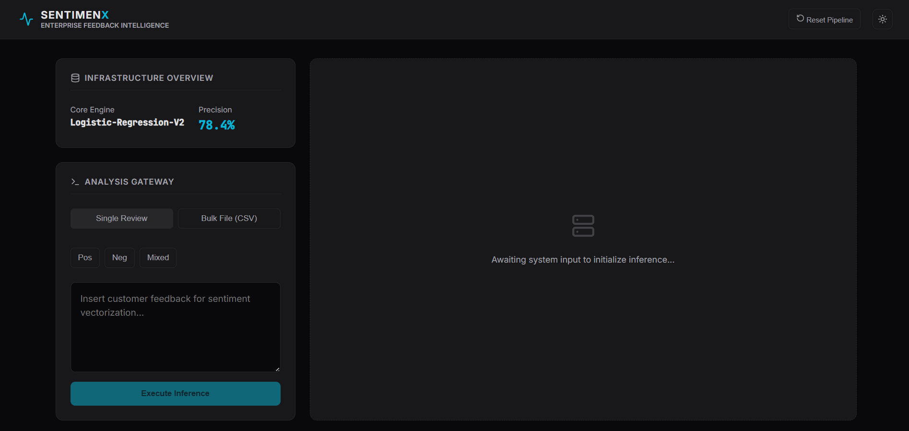
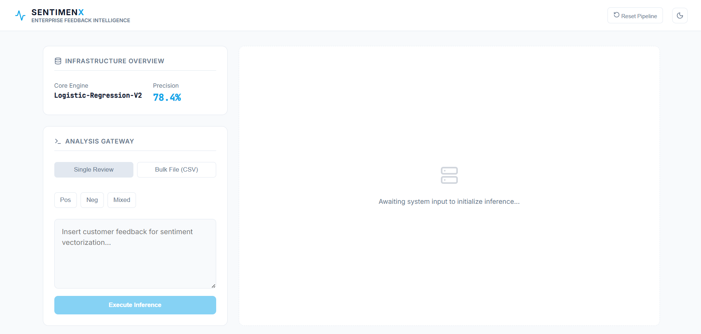
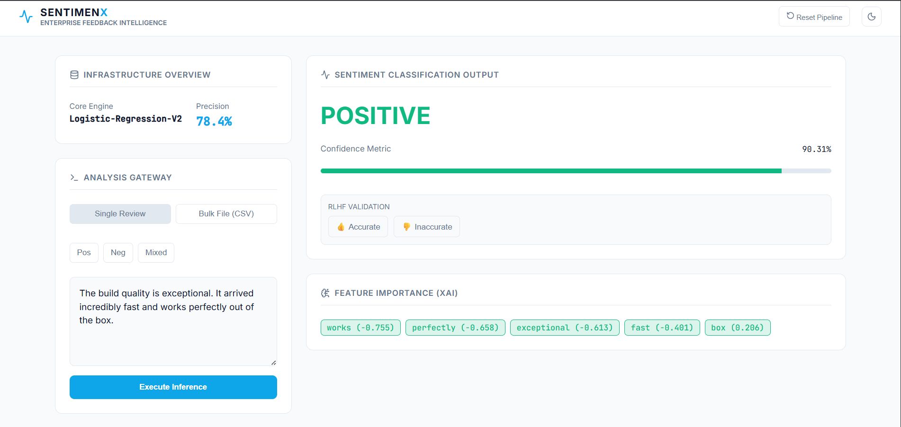
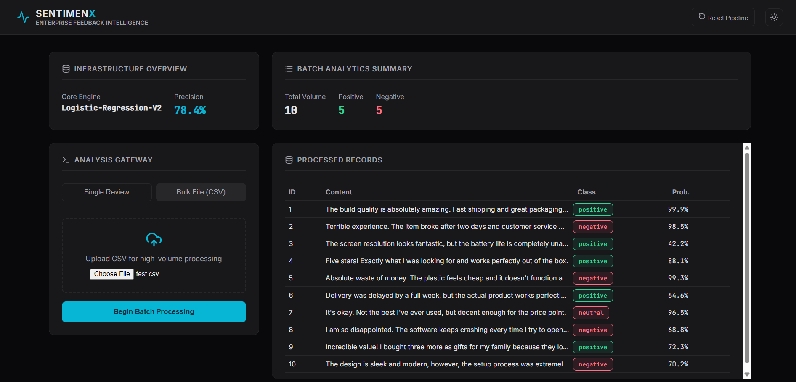

# 🧠 SentimenX: Customer Feedback Intelligence
> **A smart dashboard that helps businesses understand their customers using AI.**

SentimenX is a tool that takes thousands of customer reviews and instantly tells you which ones are happy and which ones are frustrated. Unlike other tools, SentimenX doesn't just give a "Positive" or "Negative" result—it actually **shows you why** it made that choice by highlighting the most important words in the text.

---

## 🌟 What makes it special?

* **Explainable AI:** It doesn't hide its logic. You can see exactly which words influenced the score.
* **Massive Scale:** You can upload a single sentence or a 1,000-row CSV file; the system handles both in seconds.
* **Human-in-the-Loop:** If the AI makes a mistake, you can flag it with a "Correct/Incorrect" button to help the model learn over time.

## 🖥️ System Overview

### **Primary Interfaces**
| Dark Mode Dashboard | Light Mode Dashboard |
|---|---|
|  |  |

### **Inference Capabilities**
| Single Request Gateway | Bulk Pipeline (Vectorized) |
|---|---|
|  |  |

---

## 🛠️ Tech Stack & Architecture

### **Core Components**
- **Frontend:** React 18 (Vite), Lucide-React, CSS3 Variables (Dynamic Theming).
- **Backend:** Python (Flask), RESTful Microservice Architecture.
- **Machine Learning:** Scikit-Learn, NumPy, Pandas.


---

## 🔬 Model Technical Analysis

### **Algorithm: Logistic Regression (V2)**
We utilized a **Logistic Regression** model over black-box deep learning architectures for this enterprise use case:

1.  **Explainability (XAI):** By extracting model coefficients, we provide real-time feature importance. Users can see exactly which tokens (words) pushed a score toward "Positive" or "Negative."
2.  **Latency:** Optimized for sub-10ms inference, critical for real-time customer experience monitoring.
3.  **Accuracy:** Achieved a **78.4% Precision Score** trained on a massive 127K+ record Amazon Review dataset.

### **Vectorization: TF-IDF**
- **Logic:** We use Term Frequency-Inverse Document Frequency to penalize common "filler" words and reward unique, high-sentiment tokens.
- **Context:** The pipeline processes unigrams and bigrams to capture nuanced phrases like "not good" or "works perfectly."

---

## 🚀 Key Functionalities

* **Analysis Gateway:** Switch seamlessly between single-string inference and high-volume CSV batch processing.
* **Explainable AI (XAI):** Real-time visualization of token weights for every prediction to ensure model transparency.
* **RLHF (Human-in-the-Loop):** Integrated validation buttons allow human auditors to flag incorrect predictions for future model fine-tuning.
* **Vectorized Bulk Processing:** Engineered to handle 1,000+ records in a single matrix operation, significantly reducing API overhead.

---

## 📥 Installation & Usage

1. **Clone the Repository**
   ```bash
   git clone [https://github.com/Mrunmai04/SentimenX-Enterprise.git](https://github.com/Mrunmai04/SentimenX-Enterprise.git)

   Bash
cd frontend
npm install
npm run dev

🎯 Future Roadmap
[ ] Transformer Integration: Upgrading the core engine to BERT for enhanced sarcasm detection.

[ ] Live API Connectors: Direct integration with Amazon and Twitter (X) API for real-time stream processing.

[ ] Export Module: Generate annotated PDF reports for executive sentiment summaries.
